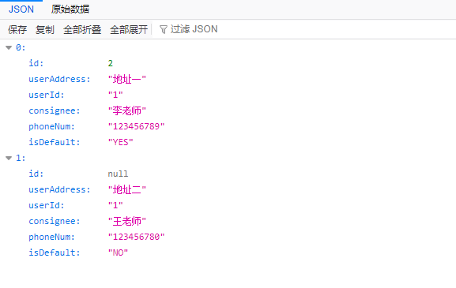

# Dubbo笔记


## 一、基础知识

### 1、分布式基础理论

**什么是分布式系统？**

《分布式系统原理与范型》定义：“分布式系统是若干独立计算机的集合，这些计算机对于用户来说就像单个相关系统”

分布式系统（distributed system）是建立在网络之上的软件系统。


随着互联网的发展，网站应用的规模不断扩大，常规的垂直应用架构已经无法应对，

分布式服务架构以及流动计算架构势在必行，亟需一个**治理系统**确保架构有条不紊的演进。


**应用架构的发展演变**


单体应用 ==> 垂直应用 ==> 分布式服务 ==> 流动计算


**RPC**

什么叫RPC？

​		Remote Procedure Call，指远程过程调用，是一种进程间通信方式，它是一种技术的思想，而不是规范。

它允许程序调用另一个地址空间（通常是共享网络的另一台机器上）的过程或函数，而不用程序员显式编码这个远程调用的细节。

即程序员无论是调用本地的还是远程的函数，本质上编写的调用代码基本相同。


RPC基本原理


RPC两个核心模块：通讯、序列化

RPC框架有很多：dubbo、gRPC、Thrift、HSF（High Speed Service Framework）


### 2、dubbo核心概念

**简介**

Apache Dubbo 是一款高性能、轻量级的开源Java RPC框架，它提供了三大核心能力：

- 面向接口的远程方法调用
- 智能容错和负载均衡
- 服务自动注册和发现

官网：http://dubbo.apache.org/


**设计架构**


### 3、dubbo环境搭建

#### Zookeeper注册中心


##### 1.下载[Zookeeper](https://zookeeper.apache.org/)

①


②


③我们下载最新的稳定版（<span style="color:red;">**这里我们应该改下载二进制包，如果下载了源码包会出现“Zookeeper启动错误2”！！（见下文）**</span>）


##### 2.Windows平台部署

将下载好的`apache-zookeeper-3.7.1.tar.gz`解压，并在解压后的目录下创建一个存放数据的目录`jianan-data`


接着我们需要将`conf`目录下的 **zoo-sample.cfg** 复制为 **zoo.cfg** 作为Zookeeper的配置文件，

并对配置文件做如下修改：


然后我们就可以去`bin`目录下通过 **cmd终端** 执行 **zkServer.cmd** 来启动Zookeeper了

<span style="color:red;">Zookeeper启动错误1：“Error:  JAVA_HOME is not set."</span>


==这是因为我们没有在本机的环境变量中配置"JAVA_HOME"，需要去配置一下==

==注意配置时不要把路径指向jdk下的bin目录，因为Zookeeper会自动加上bin目录==

<span style="color:red;">Zookeeper启动错误2：“找不到或无法加载主类”</span>


==这是因为我们下载了源码包，应该改下apache-zookeeper-3.7.1-bin.tar.gz==

==注：zookeeper 好像从 3.5 版本以后，命名就发生了改变，如果是 apache-zookeeper-3.5.5.tar.gz 这般命名的，都是未编译的，而 apache-zookeeper-3.5.5-bin.tar.gz 这般命名的，才是已编译的包。==

<span style="color:red;">Zookeeper启动错误3：找不到配置文件zoo.cfg</span>


<span style="color:green;">**Zookeeper启动成功!**</span>


Zookeeper启动成功后，我们可以通过 **zkCli.cmd** 去连接Zookeeper服务器

*Zookeeper其实是一个树型的目录服务*


#### 管理控制台

##### 1.下载dubbo-admin

①在Dubbo官网，点击GitHub，然后跳转到如下页面


②在GitHub中点击dubbo仓库，找到如下模块（在底部），并点击进入


③点击图中红框处


④下载压缩包，源码包或bin包都可以


##### 2.运行项目

将下载好的压缩包解压，目录结构如下：


进入其中的`bin`目录，可以看到dubbo-admin的启动、停止相关命令脚本


在`config`目录下可以找到dubbo-admin的配置文件**application.properties**

我们可以在其中修改连接注册中心的相关配置，默认是Zookeeper的2181端口；也支持连接其他注册中心，如nacos


<span style="color:#f00056;">**在启动dubbo-admin之前，有一个地方需要注意！**</span>

通过仔细观察Zookeeper的启动命令打印信息，我们可以看到，在Zookeeper中会有一个AdminServer服务占用8080


[解决方案](https://blog.csdn.net/saranjiao/article/details/107338152)：可以在zoo.cfg中加上 “admin.serverPort=没有被占用的端口号”


到这里，我们就可以去运行dubbo-admin项目了，在bin目录下，使用cmd终端去执行startup.cmd

启动成功之后，我们访问 http://localhost:8080/，使用 root root 去登录即可


### 4、dubbo-helloworld

#### 提出需求


#### 工程架构

根据 [《服务化最佳实践》](https://cn.dubbo.apache.org/zh-cn/docsv2.7/user/best-practice/)

#### 创建模块

分别创建三个**Maven**项目：**Provider**、**ServiceCommon**、**Consumer**，其中Provider和Consumer为*Maven父工程*；

1、在ServiceCommon中定义通用的**Bean实体类**和**Service接口**；

然后将ServiceCommon安装到本地仓库，方便Provider和Consumer引用；【[Maven本地项目之间的相互依赖](https://blog.csdn.net/guokezhongdeyuzhou/article/details/79670233)】

①定义实体类**UserAddress**

```java
package com.djn.gmall.bean;

import lombok.Data;
import lombok.NoArgsConstructor;

import java.io.Serializable;

/**
 * Name: UserAddress
 * Description: 用户地址
 * Copyright: Copyright (c) 2023 MVWCHINA All rights Reserved
 * Company: 江苏医视教育科技发展有限公司
 *
 * @author 丁佳男
 * @version 1.0
 * @since 2023/3/19 22:29
 */
@Data
@NoArgsConstructor
public class UserAddress implements Serializable {

    private Integer id;
    //用户地址
    private String userAddress;
    //用户id
    private String userId;
    //收货人
    private String consignee;
    //电话号码
    private String phoneNum;
    //是否为默认地址
    private String isDefault;
}
```

②定义接口：

**UserService**

```java
package com.djn.gmall.service;

import com.djn.gmall.bean.UserAddress;

import java.util.List;

public interface UserService {

    /**
     * 按照用户id返回所有的收货地址
     * @param userId 用户id
     * @return 收货地址集合
     */
    public List<UserAddress> getUserAddressList(String userId);
}
```

**OrderService**

```java
package com.djn.gmall.service;

public interface OrderService {

    /**
     * 初始化订单
     * @param userId 用户id
     */
    public void initOrder(String userId);
}
```


2、在Provider中引入ServiceCommon，并新建子模块**UserService**，编写UserService接口的实现类

```java
package com.djn.gmall.service.impl;

import com.djn.gmall.bean.UserAddress;
import com.djn.gmall.service.UserService;

import java.util.Arrays;
import java.util.List;

public class UserServiceImpl implements UserService {

    @Override
    public List<UserAddress> getUserAddressList(String userId) {
        UserAddress address1 = new UserAddress();
        address1.setId(1);
        address1.setUserAddress("地址一");
        address1.setUserId("1");
        address1.setConsignee("李老师");
        address1.setPhoneNum("123456789");
        address1.setIsDefault("YES");
        UserAddress address2 = new UserAddress();
        address1.setId(2);
        address2.setUserAddress("地址二");
        address2.setUserId("1");
        address2.setConsignee("王老师");
        address2.setPhoneNum("123456780");
        address2.setIsDefault("NO");

        return Arrays.asList(address1, address2);
    }
}
```


3、在Consumer中引入ServiceCommon，并新建子模块**OrderService**，编写OrderService接口的实现类

```java
package com.djn.gmall.service.impl;

import com.djn.gmall.bean.UserAddress;
import com.djn.gmall.service.OrderService;
import com.djn.gmall.service.UserService;

import java.util.List;

public class OrderServiceImpl implements OrderService {

    UserService userService;

    @Override
    public void initOrder(String userId) {
        // 1.查询用户的收货地址
        List<UserAddress> addressList = userService.getUserAddressList(userId);
        System.out.println(addressList);
    }
}
```


#### 使用dubbo改造

==基于Spring的改造，步骤如下：==

##### 将服务提供者注册到注册中心

1、导入dubbo及相关依赖

```xml
<!--引入Dubbo依赖-->
<dependency>
    <groupId>org.apache.dubbo</groupId>
    <artifactId>dubbo</artifactId>
    <version>3.1.6</version>
</dependency>
<!--引入Spring的上下文依赖-->
<dependency>
    <groupId>org.springframework</groupId>
    <artifactId>spring-context</artifactId>
    <version>5.3.25</version>
</dependency>
<!--引入服务发现的依赖-->
<dependency>
    <groupId>org.apache.curator</groupId>
    <artifactId>curator-x-discovery</artifactId>
    <version>5.2.0</version>
</dependency>
<!--引入Zookeeper依赖-->
<dependency>
    <groupId>org.apache.zookeeper</groupId>
    <artifactId>zookeeper</artifactId>
    <version>3.8.0</version>
</dependency>
```

2、配置服务端的XML配置文件**provider.xml**

在这个配置文件中，定义了 Dubbo 的应用名、Dubbo 使用的注册中心地址、发布服务的 spring bean 以及通过 Dubbo 去发布这个 bean。

<span style="color:red;">**注意！！！此处的dubbo应用名name不要使用驼峰写法，会造成启动失败，读取不到应用配置的错误！！**</span>

```xml
<?xml version="1.0" encoding="UTF-8"?>
<beans xmlns:xsi="http://www.w3.org/2001/XMLSchema-instance"
       xmlns:dubbo="http://dubbo.apache.org/schema/dubbo"
       xmlns="http://www.springframework.org/schema/beans" xmlns:context="http://www.springframework.org/schema/context"
       xsi:schemaLocation="http://www.springframework.org/schema/beans http://www.springframework.org/schema/beans/spring-beans.xsd
       http://dubbo.apache.org/schema/dubbo http://dubbo.apache.org/schema/dubbo/dubbo.xsd http://www.springframework.org/schema/context http://www.springframework.org/schema/context/spring-context.xsd">
    <context:property-placeholder/>

    <!-- 定义应用名 -->
    <dubbo:application name="user-service"/>

    <!-- 定义注册中心地址 -->
    <dubbo:registry address="zookeeper://127.0.0.1:2181"/>
    <!--第二种写法-->
    <!--<dubbo:registry protocol="zookeeper" address="127.0.0.1:2181"/>-->

    <!-- 定义实现类对应的 bean -->
    <bean id="userService" class="com.djn.gmall.service.impl.UserServiceImpl"/>
    <!-- 定义服务信息，引用上面的 bean -->
    <dubbo:service interface="com.djn.gmall.service.UserService" ref="userService"/>

</beans>
```

3、启动项目，并加载provider.xml，让dubbo自动将服务注册到注册中心

```java
package com.djn.gmall;

import org.springframework.context.support.ClassPathXmlApplicationContext;

import java.util.concurrent.CountDownLatch;

public class Application {

    public static void main(String[] args) throws InterruptedException {
        ClassPathXmlApplicationContext context = new ClassPathXmlApplicationContext("provider.xml");
        context.start();

        //挂起主线程，防止退出
        new CountDownLatch(1).await();

        //System.in.read();
    }
}
```


##### 让服务消费者去注册中心订阅服务提供者的服务地址

1、导入dubbo及相关依赖（同服务端）

2、配置消费端的XML配置文件**consumer.xml**

```xml
<?xml version="1.0" encoding="UTF-8"?>
<beans xmlns:xsi="http://www.w3.org/2001/XMLSchema-instance"
       xmlns:dubbo="http://dubbo.apache.org/schema/dubbo"
       xmlns="http://www.springframework.org/schema/beans" xmlns:context="http://www.springframework.org/schema/context"
       xsi:schemaLocation="http://www.springframework.org/schema/beans http://www.springframework.org/schema/beans/spring-beans.xsd
       http://dubbo.apache.org/schema/dubbo http://dubbo.apache.org/schema/dubbo/dubbo.xsd http://www.springframework.org/schema/context http://www.springframework.org/schema/context/spring-context.xsd">
    <context:property-placeholder/>

    <context:component-scan base-package="com.djn.gmall.service.impl"/>

    <!-- 定义应用名 -->
    <dubbo:application name="order-service"/>

    <!-- 定义注册中心地址 -->
    <dubbo:registry address="zookeeper://127.0.0.1:2181"/>

    <!-- 定义订阅信息，Dubbo 会在 Spring Context 中创建对应的 bean -->
    <dubbo:reference id="userService" interface="com.djn.gmall.service.UserService"/>

</beans>
```

3、编写项目启动类

```java
package com.djn.gmall;

import com.djn.gmall.bean.UserAddress;
import com.djn.gmall.service.OrderService;
import com.djn.gmall.service.UserService;
import org.springframework.context.support.ClassPathXmlApplicationContext;

import java.io.IOException;
import java.util.List;

public class Application {

    public static void main(String[] args) throws IOException {
        ClassPathXmlApplicationContext context = new ClassPathXmlApplicationContext("consumer.xml");
        context.start();
        OrderService orderService = context.getBean(OrderService.class);
        orderService.initOrder("1");
        System.out.println("调用完成。。。");
        System.in.read();
        System.exit(0);
    }
}
```

4、在**OrderService**中调用**UserService**

给OrderServiceImpl加上@Service注解，同时注入UserService

```java
package com.djn.gmall.service.impl;

import com.djn.gmall.bean.UserAddress;
import com.djn.gmall.service.OrderService;
import com.djn.gmall.service.UserService;
import org.springframework.stereotype.Service;

import javax.annotation.Resource;
import java.util.List;

@Service
public class OrderServiceImpl implements OrderService {

    @Resource
    UserService userService;

    @Override
    public void initOrder(String userId) {
        System.out.println("用户id：" + userId);
        // 1.查询用户的收货地址
        List<UserAddress> addressList = userService.getUserAddressList(userId);
        addressList.forEach(address -> System.out.println(address.getUserAddress()));
    }
}
```


### 5、监控中心

dubbo-admin：图形化的服务管理页面，安装时需要指定注册中心地址，即可从注册中心获取到所有提供者/消费者进行配置管理


dubbo-monitor-simple：简单的监控中心


### 6、整合SpringBoot

首先创建两个SpringBoot项目：

​    **boot-user-service**（作为Provider）

​	**boot-order-service**（作为Consumer）

并都引入**ServiceCommon**依赖，其中**boot-order-service**要引入web启动器，作为一个Web项目去运行。


① 在**boot-order-service**中编写OrderService的实现类

```java
package com.djn.gmall.service.impl;

import com.djn.gmall.bean.UserAddress;
import com.djn.gmall.service.OrderService;
import com.djn.gmall.service.UserService;
import org.springframework.stereotype.Service;

import javax.annotation.Resource;
import java.util.List;

@Service("orderService")
public class BootOrderServiceImpl implements OrderService {

    @Resource
    private UserService userService;

    @Override
    public List<UserAddress> initOrder(String userId) {
        System.out.println("用户id：" + userId);
        //1.查询用户的收获地址
        return userService.getUserAddressList(userId);
    }
}
```

编写Controller用于调用BootOrderServiceImpl

```java
package com.djn.gmall.controller;

import com.djn.gmall.bean.UserAddress;
import com.djn.gmall.service.OrderService;
import org.springframework.web.bind.annotation.GetMapping;
import org.springframework.web.bind.annotation.RequestParam;
import org.springframework.web.bind.annotation.RestController;

import javax.annotation.Resource;
import java.util.List;

@RestController
public class OrderController {

    @Resource
    OrderService orderService;

    @GetMapping("initOrder")
    public List<UserAddress> initOrder(@RequestParam("uid") String userId) {
        return orderService.initOrder(userId);
    }
}
```


② 在**boot-user-service**中编写UserService的实现类

```java
package com.djn.gmall.service.impl;

import com.djn.gmall.bean.UserAddress;
import com.djn.gmall.service.UserService;
import org.springframework.stereotype.Service;

import java.util.Arrays;
import java.util.List;

@Service
public class BootUserServiceImpl implements UserService {

    @Override
    public List<UserAddress> getUserAddressList(String s) {
        UserAddress address1 = new UserAddress();
        address1.setId(1);
        address1.setUserAddress("地址一");
        address1.setUserId("1");
        address1.setConsignee("李老师");
        address1.setPhoneNum("123456789");
        address1.setIsDefault("YES");
        UserAddress address2 = new UserAddress();
        address1.setId(2);
        address2.setUserAddress("地址二");
        address2.setUserId("1");
        address2.setConsignee("王老师");
        address2.setPhoneNum("123456780");
        address2.setIsDefault("NO");

        return Arrays.asList(address1, address2);
    }
}
```


③ 配置远程调用

**Provider**

添加依赖

```xml
<dependency>
    <groupId>org.apache.dubbo</groupId>
    <artifactId>dubbo-spring-boot-starter</artifactId>
    <version>3.1.6</version>
</dependency>
<dependency>
    <groupId>org.apache.dubbo</groupId>
    <artifactId>dubbo-dependencies-zookeeper-curator5</artifactId>
    <version>3.2.0-beta.4</version>
    <type>pom</type>
    <exclusions>
        <exclusion>
            <groupId>org.slf4j</groupId>
            <artifactId>slf4j-reload4j</artifactId>
        </exclusion>
        <exclusion>
            <groupId>org.slf4j</groupId>
            <artifactId>slf4j-log4j12</artifactId>
        </exclusion>
    </exclusions>
</dependency>
```

填写配置

```properties
#服务注册名
dubbo.application.name=boot-user-service
#注册中心地址
dubbo.registry.address=127.0.0.1:2181
#注册中心访问协议
dubbo.registry.protocol=zookeeper

#通信协议
dubbo.protocol.name=dubbo
#通信端口
dubbo.protocol.port=-1

#配置连接监控中心
dubbo.monitor.protocol=registry
```

【小拓展：[dubbo.protocol.port = -1](https://blog.csdn.net/hold_on_/article/details/113940136)】

使用@DubboService注解将服务的实现暴露出去

```java
package com.djn.gmall.service.impl;

import com.djn.gmall.bean.UserAddress;
import com.djn.gmall.service.UserService;
import org.apache.dubbo.config.annotation.DubboService;
import org.springframework.stereotype.Service;

import java.util.Arrays;
import java.util.List;

@DubboService
@Service
public class BootUserServiceImpl implements UserService {

    @Override
    public List<UserAddress> getUserAddressList(String s) {
        UserAddress address1 = new UserAddress();
        address1.setId(1);
        address1.setUserAddress("地址一");
        address1.setUserId("1");
        address1.setConsignee("李老师");
        address1.setPhoneNum("123456789");
        address1.setIsDefault("YES");
        UserAddress address2 = new UserAddress();
        address1.setId(2);
        address2.setUserAddress("地址二");
        address2.setUserId("1");
        address2.setConsignee("王老师");
        address2.setPhoneNum("123456780");
        address2.setIsDefault("NO");

        return Arrays.asList(address1, address2);
    }
}
```

开启基于注解的dubbo功能，并启动项目

```java
package com.djn.gmall;

import org.apache.dubbo.config.spring.context.annotation.EnableDubbo;
import org.springframework.boot.SpringApplication;
import org.springframework.boot.autoconfigure.SpringBootApplication;

@EnableDubbo //开启基于注解的dubbo功能
@SpringBootApplication
public class BootUserServiceApplication {

    public static void main(String[] args) {
        SpringApplication.run(BootUserServiceApplication.class, args);
    }

}
```


**Consumer**

添加依赖（同上）

填写配置

```properties
#服务注册名
dubbo.application.name=boot-order-service
#注册中心地址
dubbo.registry.address=127.0.0.1:2181
#注册中心访问协议
dubbo.registry.protocol=zookeeper

#通信协议
dubbo.protocol.name=dubbo
#通信端口
dubbo.protocol.port=-1

#配置连接监控中心
dubbo.monitor.protocol=registry
```

使用@DubboReference注解引入服务的实现

```java
package com.djn.gmall.service.impl;

import com.djn.gmall.bean.UserAddress;
import com.djn.gmall.service.OrderService;
import com.djn.gmall.service.UserService;
import org.apache.dubbo.config.annotation.DubboReference;
import org.springframework.stereotype.Service;

import java.util.List;

@Service("orderService")
public class BootOrderServiceImpl implements OrderService {

    @DubboReference
    private UserService userService;

    @Override
    public List<UserAddress> initOrder(String userId) {
        System.out.println("用户id：" + userId);
        //1.查询用户的收获地址
        return userService.getUserAddressList(userId);
    }
}
```

修改Web项目的端口号，开启基于注解的Dubbo功能，并启动项目

`server.port=8090`

```java
package com.djn.gmall;

import org.apache.dubbo.config.spring.context.annotation.EnableDubbo;
import org.springframework.boot.SpringApplication;
import org.springframework.boot.autoconfigure.SpringBootApplication;

@EnableDubbo
@SpringBootApplication
public class BootOrderServiceApplication {

    public static void main(String[] args) {
        SpringApplication.run(BootOrderServiceApplication.class, args);
    }

}
```

访问路径：http://localhost:8090/initOrder?uid=1，得到的结果如下




## 二、Dubbo配置

dubbo的详细配置项可见官网：[配置手册](https://cn.dubbo.apache.org/zh-cn/overview/mannual/java-sdk/reference-manual/config/) ==> **配置项手册**

dubbo的配置覆盖策略：


### 启动时检查


#### 使用方式：

##### 一、通过Spring配置文件

**关闭某个服务的启动时检查**

==如果没有设置值，会去找dubbo.consumer的值，如果还没找到，会使用dubbo的默认值true==

```xml
<!-- 定义订阅信息，Dubbo 会在 Spring Context 中创建对应的 bean -->
<dubbo:reference id="userService" interface="com.djn.gmall.service.UserService" check="false"/>
```


**关闭所有服务的启动时检查**

```xml
<!--配置当前消费者的统一规则：所有的服务都不进行“启动时检查”-->
<dubbo:consumer check="false"/>
```


**关闭注册中心的启动时检查**

- <span style="color:red;">前面两个都是指订阅成功，但提供者未提供服务时是否报错；这个是指如果注册订阅失败时，也允许启动</span>

- 如果使用此选项，将在后台定时重试。

```xml
<!--关闭注册中心启动时检查-->
<dubbo:registry check="false"/>
```


##### 二、通过dubbo.properties及注解

**关闭某个服务的启动时检查**

```java
@DubboReference(check = false)
private UserService userService;
```


**关闭所有服务的启动时检查**

```properties
#配置当前消费者的统一规则：所有的服务都不进行“启动时检查”
dubbo.consumer.check=false
```


**关闭注册中心的启动时检查**

```properties
#关闭注册中心启动时检查
dubbo.registry.check=false
```


##### 三、通过 -D 参数

```java
java -Ddubbo.reference.com.foo.BarService.check=false
java -Ddubbo.consumer.check=false 
java -Ddubbo.registry.check=false
```


### 超时 与 配置的覆盖关系


## 三、高可用


## 四、Dubbo原理